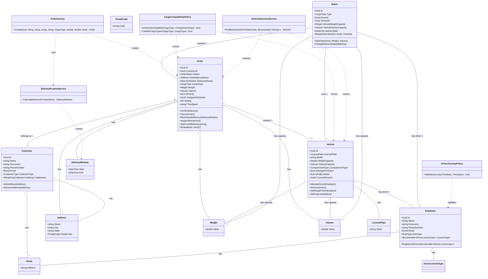

## 1. Identificação do projeto

- Nome do projeto: LogisticsDeliveryManager.API
- Integrantes do grupo: **Keven Lucas, Lucas Barreto Fontinele e Leonardo Capistrano**
- Link do repositório: https://github.com/lucasfontinele/LogisticsDeliveryManager.API
- Tecnologia utilizada: .NET 10, PostgreSQL via Supabase
- Funcionalidade principal desenvolvida: Sistema de Logística com Lotes (Batch), Janelas de Entrega e Seleção Inteligente de Veículos

## 2. Descrição do case

O case aborda um **sistema de logística voltado para a gestão e organização de entregas**. O principal problema de negócio resolvido pelo projeto é a orquestração complexa de pedidos, considerando que cada entrega possui exigências específicas, como janela de horário, tipo de carga, peso, volume e requisitos especiais (como cargas refrigeradas, frágeis ou perigosas).

Para resolver esse problema, o sistema atua em diversas frentes operacionais e logísticas:

- **Gestão de Frota e Motoristas:** O sistema deve considerar a capacidade máxima dos veículos, os tipos de compartimento disponíveis, a categoria de habilitação dos motoristas e a limitação legal da jornada diária de trabalho.
- **Planejamento e Execução de Rotas:** O sistema gerencia o planejamento diário de rotas em lotes, lidando com fatores que podem gerar alterações imprevistas, como trânsito, avaria mecânica, ausência do cliente ou erro no endereço.
- **Garantia das Regras de Negócio e Promessas:** O sistema implementa o controle sobre regras críticas, como a "promessa de entrega" ao cliente (que pode gerar multas se descumprida), restrições que impedem o compartilhamento de determinados tipos de carga no mesmo veículo, prioridades para clientes premium e janelas de horário extremamente rígidas para medicamentos.
- **Acompanhamento Pós-Execução:** Contempla o registro da execução real das rotas, incluindo horário de chegada, anexação de fotos e comprovantes, avaliação de satisfação do cliente e abertura de investigações internas para registrar e tratar incidentes. Além disso, suporta cenários logísticos de exceção, como entregas parciais, devoluções, reagendamentos e redirecionamentos para outros centros de distribuição.

Este projeto resolve um problema de logística de entregas, com foco em:

- Gerenciamento de pedidos (Orders)
- Criação de lotes (Batches) para otimizar entregas
- Cálculo de promessas de entrega (SLAs)
- Seleção de veículos compatíveis com o tipo de carga
- Rastreamento de status de entrega
- Validação de regras de jornada de motoristas

## 3. Estado do projeto antes da análise externa

Antes da refatoração realizada no Entregável 02, o projeto apresentava uma base inicial com a aplicação de alguns conceitos de Domain-Driven Design (DDD), mas ainda exibia fortes características de um sistema estrutural e orientado a operações CRUD (Create, Read, Update, Delete). A organização e as decisões arquiteturais encontravam-se no seguinte estado:

- **Organização e Arquitetura:** O sistema estava estruturado em camadas puramente técnicas: `LogisticsDeliveryManager.API`, `Application`, `Domain`, `Infrastructure` e `Communication`. Dentro das camadas, a divisão continuava técnica. No domínio, os arquivos eram agrupados em pastas como `Entities`, `Enums`, `Repositories`, `Services` e `ValueObjects`, enquanto na aplicação (Use Cases) a separação era feita por entidades (`Orders`, `Vehicles`, etc.), sem refletir os contextos reais de negócio.
- **Isolamento do Domínio:** A inversão de dependência era aplicada corretamente, com as interfaces dos repositórios no domínio e as implementações concretas na infraestrutura. O domínio não dependia diretamente de banco de dados ou frameworks externos, mas seu isolamento era apenas parcial, pois possuía dependência indevida de bibliotecas de exceções externas.
- **Modelagem de Entidades e Value Objects (VOs):** As entidades possuíam algumas regras de negócio, mas dependiam excessivamente de métodos genéricos de alteração de estado (como `UpdateStatus`, `SetReadyForOrders` e `SetFullyLoaded`), que comunicavam pouca intenção de negócio. Faltavam *Value Objects* para conceitos cruciais do domínio (peso, volume, placa, janela de entrega), utilizando-se muitos tipos primitivos, com exceção de `Email` e `PostalCode` que já haviam sido isolados. Além disso, classes como `Address` e `BatchOrder` foram modeladas como entidades independentes com identidade própria, o que não refletia a realidade do domínio logístico.
- **Aggregates (Agregados):** Havia tentativas de garantir a consistência das fronteiras, como a entidade `Batch` validando o limite de peso e volume ao adicionar um pedido. No entanto, as fronteiras reais dos agregados não estavam claras. Ocorria o acoplamento excessivo onde uma entidade carregava referências completas para outras (ex: `Order` carregando o objeto inteiro de `Customer`, `Address` e `Vehicle` em vez de apenas seus IDs).
- **Factories e Domain Services:** Não havia o uso explícito de *Factories*; a criação complexa de entidades contendo diversas regras ficava concentrada nos construtores diretamente dentro dos *Application Services* (Use Cases). Os *Domain Services* existiam (como o `OrderRoutingDomainService`), porém eram subutilizados, servindo predominantemente para realizar validações de unicidade (como verificação de e-mail ou placa já cadastrados) em vez de orquestrarem regras ricas de roteirização e logística.
- **Rastreabilidade e Design Visual:** As principais regras operacionais do *case*, como controle de jornada do motorista, multas de SLA e políticas de restrição de cargas, eram difíceis de rastrear ou estavam ausentes do código. O diagrama de domínio existente refletia o sistema sob uma ótica puramente estrutural e relacional, assemelhando-se a um modelo de tabelas de banco de dados, sem evidenciar *Aggregates*, *Value Objects* ou *Domain Services*.

#### Em resumo

- Estrutura mais focada em CRUD
- Uso excessivo de tipos primitivos em vez de Value Objects expressivos
- Entidades sem comportamentos de negócio claros
- Agregados mal definidos com referências diretas a outras raízes
- BatchOrder como entidade independente
- Driver como entidade separada de Employee
- Validações de negócio dispersas

## 4. Alterações realizadas pelo outro grupo

As principais alterações propostas e implementadas pelo grupo analisador:

1. **Fase 1: Value Objects e Entidades (REF02, REF04, REF15)**
    - Transformou `Address.cs` em Value Object (record imutável sem Id)
    - Criou Value Objects `DeliveryWindow`, `Weight`, `Volume` e `LicensePlate`
    - Atualizou `Order.cs` e `Vehicle.cs` para usar esses novos VOs
2. **Fase 2: Expressividade e Comportamento (REF01, REF14)**
    - Remover método genérico `UpdateStatus` em `Order.cs`
    - Criou métodos específicos de negócio: `ConfirmDelivery()`, `CancelOrder()`, `RescheduleDelivery()`
3. **Fase 3: Fronteiras de Consistência (REF03, REF05)**
    - Modificou `Batch.cs` para encapsular `BatchOrder` como objeto interno
    - Substituiu propriedades de navegação por IDs nas entidades (ex: `CustomerId` em vez de `Customer`)
4. **Fase 4: Serviços e Políticas (REF08, REF09, REF10)**
    - Criou Domain Services: `DeliveryPromiseService`, `DriverJourneyPolicy`, `CargoCompatibilityPolicy`
5. **Fase 5: Factories (REF11)**
    - Criou `OrderFactory` para centralizar a criação complexa de pedidos
    - Refatorou `CreateOrderUseCase` para usar a Factory
6. **Unificação de Driver e Employee (REF06)**
    - Eliminou entidade `Driver` como separada
    - Adicionou perfil de motorista em `Employee` através de `RoleType` e `LicenseTypes`
7. **VehicleSelectionService (REF07)**
    - Criou `VehicleSelectionService` para seleção do melhor veículo para um pedido

## 5. Avaliação das alterações recebidas

### Alterações mantidas (todas)

- Transformação de `Address` em Value Object
- Criação de todos os Value Objects (DeliveryWindow, Weight, Volume, LicensePlate, Email, PostalCode)
- Métodos de negócio em `Order` (ConfirmDelivery, CancelOrder, RescheduleDelivery)
- `BatchOrder` como objeto interno de `Batch`
- Unificação de `Driver` em `Employee`
- Todos os Domain Services criados (DeliveryPromiseService, DriverJourneyPolicy, CargoCompatibilityPolicy, VehicleSelectionService)
- `OrderFactory`

### Justificativa:

Todas as alterações foram aceitas e mantidas porque elas:

- Aumentam a expressividade do domínio
- Protegem as invariantes de negócio
- Melhoram a testabilidade e manutenibilidade
- Aplicam os princípios do DDD de forma correta

## 6. Melhorias adicionais realizadas pelo grupo original

- Foram realizadas correções de enumerações que não estavam sendo aplicadas corretamente no banco de dados, garantindo consistência entre o modelo e a persistência.
- O fluxo de motorista foi consolidado no contexto de `Employee`, com remoção dos artefatos separados de `Driver` na API e na aplicação.
- Os contratos de resposta de `Batch` foram ajustados para expor `DriverId` e `VehicleId`, reforçando o uso de referências por ID entre agregados.

## 7. Linguagem Ubíqua

| Termo | Significado |
| --- | --- |
| **Order (Pedido)** | Entidade principal do negócio, representa uma entrega a ser realizada |
| **Customer (Cliente)** | Pessoa física ou jurídica que solicita uma entrega |
| **Employee (Funcionário)** | Pessoa que trabalha na empresa, pode ser Motorista (Driver) ou outro cargo |
| **Driver (Motorista)** | Perfil de funcionário que pode realizar entregas, precisa de licenças |
| **Vehicle (Veículo)** | Meio de transporte para realizar entregas, com capacidade de peso e volume |
| **Batch (Lote)** | Agrupamento de pedidos para serem entregues juntos por um motorista em um veículo |
| **Delivery Window (Janela de Entrega)** | Intervalo de tempo (início e fim) em que uma entrega deve ser realizada |
| **Cargo Type (Tipo de Carga)** | Tipo da carga do pedido (Food, Medicine, Refrigerated, Dangerous, etc.) |
| **Compartment Type (Tipo de Compartimento)** | Tipo de compartimento do veículo (General, RefrigeratedBody, IsothermalBody) |
| **Order Status (Status do Pedido)** | Estado do pedido no ciclo de entrega (Pending, InTransit, Delivered, Cancelled, Rescheduled) |

## 8. Módulos

Atualmente o projeto está organizado por camadas técnicas, e os módulos de negócio são:

### Módulo Orders (Pedidos)

- **Entidades**: Order
- **Value Objects**: Address, DeliveryWindow, Weight, Volume
- **Domain Services**: IDeliveryPromiseService, ICargoCompatibilityPolicy, IOrderRoutingDomainService
- **Factories**: OrderFactory
- **Repositórios**: IOrderRepository

### Módulo Batches (Lotes)

- **Entidades**: Batch, BatchOrder (interno)
- **Value Objects**: Weight, Volume
- **Repositórios**: IBatchRepository

### Módulo Fleet (Frota)

- **Entidades**: Vehicle
- **Value Objects**: LicensePlate, Weight, Volume
- **Domain Services**: IVehicleSelectionService
- **Repositórios**: IVehicleRepository

### Módulo Customers (Clientes)

- **Entidades**: Customer
- **Value Objects**: Address, Email, PostalCode
- **Domain Services**: ICustomerDomainService
- **Repositórios**: ICustomerRepository

### Módulo Employees (Funcionários)

- **Entidades**: Employee
- **Value Objects**: Email
- **Domain Services**: IEmployeeDomainService
- **Repositórios**: IEmployeeRepository

## 9. Entities

### Order

- **Identidade**: Id (Guid)
- **Responsabilidades**: Representa um pedido de entrega, manter seu estado e comportamento de negócio
- **Comportamentos**: `ConfirmDelivery()`, `CancelOrder()`, `RescheduleDelivery()`, `AssignVehicle()`, `SetProofOfDelivery()`, `Evaluate()`
- **Regras de negócio**: Não pode confirmar/cancelar/reescalonar pedido já entregue; Janela de entrega não pode ser no passado; Avaliação só pode ser feita em pedidos entregues; Rating deve ser entre 1 e 5
- **Ciclo de vida**: Pending → (InTransit) → Delivered / Cancelled / Rescheduled
- **Justificativa**: Possui identidade única, ciclo de vida e comportamento de negócio complexo

### Customer

- **Identidade**: Id (Guid)
- **Responsabilidades**: Representa um cliente, gerenciar seus endereços
- **Comportamentos**: `AddAddress()`, `AddAddresses()`, `RemoveAddress()`
- **Regras de negócio**: Deve ter pelo menos um endereço
- **Ciclo de vida**: Ativo / Inativo (soft delete)
- **Justificativa**: Possui identidade única, é referenciado por pedidos

### Employee

- **Identidade**: Id (Guid)
- **Responsabilidades**: Representa um funcionário, pode ser motorista
- **Comportamentos**: `RegisterAsDriver()`
- **Regras de negócio**: Para ser motorista, deve ter pelo menos uma licença
- **Ciclo de vida**: Ativo / Inativo (soft delete)
- **Justificativa**: Possui identidade única, é referenciado por veículos e lotes

### Vehicle

- **Identidade**: Id (Guid)
- **Responsabilidades**: Representa um veículo da frota
- **Comportamentos**: `AllocateDriver()`, `RemoveDriver()`, `SetReadyForOrders()`, `SetFullyLoaded()`
- **Regras de negócio**: Placa é única; Modelo não pode ser vazio; Capacidades devem ser positivas
- **Ciclo de vida**: Ativo / Inativo (soft delete)
- **Justificativa**: Possui identidade única, é referenciado por lotes e pedidos

### Batch

- **Identidade**: Id (Guid)
- **Responsabilidades**: Representa um lote de pedidos para entrega
- **Comportamentos**: `AddOrder()`, `ChangeDeliveryDate()`
- **Regras de negócio**: Não pode exceder capacidade de peso/volume do veículo; Pedido não pode ser adicionado mais de uma vez; Data de entrega não pode ser no passado
- **Ciclo de vida**: Ativo / Inativo (soft delete)
- **Justificativa**: Possui identidade única, é agregado que encapsula BatchOrder

### DeliveryTrackingEvent

- **Identidade**: Id (Guid)
- **Responsabilidades**: Rastreamento do histórico de entrega
- **Regras de negócio**: Data estimada não pode ser no passado
- **Ciclo de vida**: Criado uma vez
- **Justificativa**: Possui identidade única, registra eventos históricos

## 10. Value Objects

### Address

- **Atributos**: Street, City, State, PostalCode
- **Validações**: Street, City e State não podem ser vazios; PostalCode válido
- **Regras protegidas**: Garante que endereços sejam consistentes
- **Critérios de igualdade**: Todos os atributos
- **Justificativa**: Sem identidade própria, imutável, igualdade por valor

### DeliveryWindow

- **Atributos**: Start, End
- **Validações**: Start e End são obrigatórios; Start < End
- **Regras protegidas**: Garante janelas de entrega válidas
- **Critérios de igualdade**: Start e End
- **Justificativa**: Sem identidade própria, imutável, igualdade por valor

### Weight

- **Atributos**: Value (double)
- **Validações**: Value > 0
- **Regras protegidas**: Garante pesos positivos
- **Critérios de igualdade**: Value
- **Justificativa**: Sem identidade própria, imutável, igualdade por valor

### Volume

- **Atributos**: Value (double)
- **Validações**: Value > 0
- **Regras protegidas**: Garante volumes positivos
- **Critérios de igualdade**: Value
- **Justificativa**: Sem identidade própria, imutável, igualdade por valor

### LicensePlate

- **Atributos**: Value (string)
- **Validações**: Não vazio; Formato válido (letras, números, hífen, até 10 caracteres)
- **Regras protegidas**: Garante placas válidas e normalizadas
- **Critérios de igualdade**: Value (normalizado)
- **Justificativa**: Sem identidade própria, imutável, igualdade por valor

### Email

- **Atributos**: Address (string)
- **Validações**: Não vazio; Formato válido
- **Regras protegidas**: Garante e-mails válidos
- **Critérios de igualdade**: Address
- **Justificativa**: Sem identidade própria, imutável, igualdade por valor

### PostalCode

- **Atributos**: Code (string)
- **Validações**: Não vazio; Formato #####-###
- **Regras protegidas**: Garante CEPs válidos
- **Critérios de igualdade**: Code
- **Justificativa**: Sem identidade própria, imutável, igualdade por valor

## 11. Aggregates e Aggregate Roots

### Aggregate Order

- **Aggregate Root**: Order
- **Objetos internos**: DestinationAddress (VO), DeliveryWindow (VO), Weight (VO), Volume (VO)
- **Fronteira de consistência**: Tudo acessível através de Order
- **Invariantes**: Status válido, endereço válido, janela de entrega válida
- **Operações controladas pela raiz**: Todos os métodos de Order
- **Objetos que ficaram fora do Aggregate**: Customer (referenciado por CustomerId), Vehicle (referenciado por AssignedVehicleId)
- **Justificativa**: Order é a entidade principal, as outras são referenciadas apenas por ID para manter a consistência do agregado

### Aggregate Batch

- **Aggregate Root**: Batch
- **Objetos internos**: BatchOrder (interno), VehicleWeightCapacity (VO), VehicleVolumeCapacity (VO)
- **Fronteira de consistência**: Tudo acessível através de Batch
- **Invariantes**: Capacidade de peso/volume não excedida; Pedidos únicos no lote
- **Operações controladas pela raiz**: AddOrder(), ChangeDeliveryDate()
- **Objetos que ficaram fora do Aggregate**: Driver (referenciado por DriverId), Vehicle (referenciado por VehicleId), Orders (referenciados por OrderIds)
- **Justificativa**: Batch é a entidade principal, BatchOrder é interno para manter a consistência do agregado

### Aggregate Customer

- **Aggregate Root**: Customer
- **Objetos internos**: Addresses (lista de VOs), Email (VO)
- **Fronteira de consistência**: Tudo acessível através de Customer
- **Invariantes**: Pelo menos um endereço
- **Operações controladas pela raiz**: AddAddress(), RemoveAddress()
- **Justificativa**: Customer é a entidade principal, endereços são parte do cliente

### Aggregate Employee

- **Aggregate Root**: Employee
- **Objetos internos**: Email (VO), LicenseTypes (enum)
- **Fronteira de consistência**: Tudo acessível através de Employee
- **Invariantes**: Se for Driver, tem pelo menos uma licença
- **Operações controladas pela raiz**: RegisterAsDriver()
- **Justificativa**: Employee é a entidade principal, perfis são parte do funcionário

### Aggregate Vehicle

- **Aggregate Root**: Vehicle
- **Objetos internos**: LicensePlate (VO), WeightCapacity (VO), VolumeCapacity (VO)
- **Fronteira de consistência**: Tudo acessível através de Vehicle
- **Invariantes**: Placa única, capacidades válidas
- **Operações controladas pela raiz**: AllocateDriver(), RemoveDriver()
- **Objetos que ficaram fora do Aggregate**: Employee (referenciado por CurrentDriverId)
- **Justificativa**: Vehicle é a entidade principal, motorista é referenciado por ID

## 12. Factories

### OrderFactory

- **Objetos criados**: Order
- **Regras aplicadas durante a criação**:
    - Cria Address com PostalCode válido
    - Calcula DeliveryWindow via DeliveryPromiseService
    - Cria Weight e Volume válidos
    - Cria Order com todos os valores válidos
- **Justificativa**: A criação de Order envolve múltiplos objetos de valor e regras, centraliza essa lógica

## 13. Domain Services

### IDeliveryPromiseService (DeliveryPromiseService)

- **Responsabilidades**: Calcular promessa de entrega (SLA) com base em prioridade; Validar DeliveryWindow
- **Por que não pertence a uma Entity**: Envolve regras de negócio que não são responsabilidade de uma única entidade

### ICargoCompatibilityPolicy (CargoCompatibilityPolicy)

- **Responsabilidades**: Verificar compatibilidade entre tipo de carga e tipo de compartimento do veículo; Verificar se dois tipos de carga podem ser misturados
- **Por que não pertence a uma Entity**: Envolve regras de negócio entre múltiplas entidades (Order e Vehicle)

### IDriverJourneyPolicy (DriverJourneyPolicy)

- **Responsabilidades**: Validar jornada do motorista (duração máxima por viagem e diária)
- **Por que não pertence a uma Entity**: Envolve regras de negócio de política de RH/logística

### IVehicleSelectionService (VehicleSelectionService)

- **Responsabilidades**: Encontrar o melhor veículo para um pedido com base em disponibilidade, capacidades e compatibilidade de carga
- **Por que não pertence a uma Entity**: Envolve lógica de escolha entre múltiplas entidades

### IOrderRoutingDomainService (OrderRoutingDomainService)

- **Responsabilidades**: Orquestrar serviços para roteamento de pedidos (SLA e seleção de veículo)
- **Por que não pertence a uma Entity**: Orquestra múltiplos domain services

## 14. Repositories

### IOrderRepository

- **Aggregate persistido**: Order
- **Separação de interface/implementação**: Interface no Domain, implementação no Infrastructure

### ICustomerRepository

- **Aggregate persistido**: Customer
- **Separação de interface/implementação**: Interface no Domain, implementação no Infrastructure

### IEmployeeRepository

- **Aggregate persistido**: Employee
- **Separação de interface/implementação**: Interface no Domain, implementação no Infrastructure

### IVehicleRepository

- **Aggregate persistido**: Vehicle
- **Separação de interface/implementação**: Interface no Domain, implementação no Infrastructure

### IBatchRepository

- **Aggregate persistido**: Batch
- **Separação de interface/implementação**: Interface no Domain, implementação no Infrastructure

### IUnitOfWork

- **Responsabilidade**: Gerenciar transações e salvar alterações em múltiplos repositórios

## 15. Regras de negócio

| Regra de negócio | Classe responsável | Forma de proteção |
| --- | --- | --- |
| Pedido não pode ser confirmado se já foi entregue | Order | Método `ConfirmDelivery()` valida o status |
| Pedido não pode ser cancelado se já foi entregue | Order | Método `CancelOrder()` valida o status |
| Janela de entrega não pode ser no passado | Order | Método `RescheduleDelivery()` valida a data |
| Avaliação só pode ser feita em pedido entregue | Order | Método `Evaluate()` valida o status |
| Rating deve ser entre 1 e 5 | Order | Método `Evaluate()` valida o rating |
| Cliente deve ter pelo menos um endereço | Customer | Construtor e `AddAddresses()` |
| Motorista deve ter pelo menos uma licença | Employee | Método `RegisterAsDriver()` |
| Placa do veículo deve ser única | IVehicleRepository, CustomerDomainService | `ExistActiveVehicleWithLicensePlate()` |
| Lote não pode exceder capacidade de peso do veículo | Batch | Método `AddOrder()` valida soma de pesos |
| Lote não pode exceder capacidade de volume do veículo | Batch | Método `AddOrder()` valida soma de volumes |
| Pedido não pode ser adicionado mais de uma vez ao lote | Batch | Método `AddOrder()` valida duplicidade |
| Data de entrega do lote não pode ser no passado | Batch | Método `ChangeDeliveryDate()` e construtor |
| Peso e volume devem ser maiores que zero | Weight, Volume | Construtores |
| Janela de entrega deve ter início < fim | DeliveryWindow | Construtor |
| Carga perigosa não pode ser misturada com tipos específicos | CargoCompatibilityPolicy | Método `CanMixCargoTypes()` |
| Carga refrigerada ou medicamento só podem ser transportados em compartimento refrigerado | CargoCompatibilityPolicy | Método `IsVehicleCompatible()` |
| Jornada do motorista não pode exceder 10h viagem / 11h diária | DriverJourneyPolicy | Método `ValidateJourney()` |
| Pedido prioritário tem SLA de 1 dia; padrão de 3 dias | DeliveryPromiseService | Método `CalculateDeliveryPromise()` |

## 16. Aplicação de Supple Design

### Intention-Revealing Interfaces (Interfaces Reveladoras de Intenção)

- Métodos em Order: `ConfirmDelivery()`, `CancelOrder()`, `RescheduleDelivery()` em vez de `UpdateStatus()`
- Métodos em Batch: `AddOrder()`, `ChangeDeliveryDate()`
- Domain Services com nomes claros: `DeliveryPromiseService`, `VehicleSelectionService`

### Assertions (Afirmações)

- Todos os Value Objects validam seus valores no construtor
- Entidades validam invariantes no construtor e em métodos
- Domain Services validam regras de negócio

### Side-Effect-Free Functions (Funções Sem Efeitos Colaterais)

- Métodos de Value Objects são imutáveis
- Métodos de cálculo como `CalculateDeliveryPromise()` não alteram estado
- Métodos de validação são side-effect free

## 17. Arquitetura final

O projeto segue a arquitetura em camadas limpa (Clean Architecture):

### Domain (Camada de Domínio)

- **Responsabilidades**: Contém entidades, value objects, agregados, domain services, factories e interfaces de repositórios
- **Dependências**: Não depende de nenhuma outra camada

### Application (Camada de Aplicação)

- **Responsabilidades**: Contém Use Cases (serviços de aplicação), AutoMapper profiles
- **Dependências**: Depende apenas da camada Domain

### Infrastructure (Camada de Infraestrutura)

- **Responsabilidades**: Implementações de repositórios, DbContext, configuração de banco de dados, integração com Supabase
- **Dependências**: Depende da camada Domain e Application

### API (Camada de Apresentação)

- **Responsabilidades**: Controllers, configuração de endpoints, injeção de dependência
- **Dependências**: Depende da camada Application e Infrastructure

## 18. Diagrama do modelo de domínio



## 19. Testes e validações realizadas

- **Testes manuais**: Validação do endpoint GET /api/Order após a correção do Include desnecessário
- **Validações de build**: Build bem-sucedido do projeto
- **Validações de regra de negócio**: Validações de Value Objects, entidades e domain services já implementadas

## 20. Instruções para execução

### Pré-requisitos

- .NET 10 SDK
- PostgreSQL (ou Supabase configurado)

### Configuração

1. Renomeie `appsettings.Development.json.example` para `appsettings.Development.json`
2. Configure a string de conexão do Supabase no arquivo

### Execução

```bash
# Restaurar dependências
dotnet restore

# Build do projeto
dotnet build

# Executar a API
cd src/LogisticsDeliveryManager.API
dotnet run
```

### Acesso

- API: https://localhost:5059 (ou http://localhost:5058)
- Swagger: https://localhost:5059/swagger

## 21. Limitações e trabalhos futuros

- **Testes automatizados**: Adicionar testes unitários para domain services, value objects e entidades; Adicionar testes de integração para repositórios e use cases
- **Organização por módulos de negócio**: Reorganizar as pastas do projeto para refletir conceitos de negócio em vez de camadas técnicas (ex: `/Orders`, `/Batches`, `/Fleet`)
- **Eventos de domínio**: Implementar eventos de domínio para reações a mudanças de estado (ex: `OrderDeliveredEvent`, `BatchCreatedEvent`)
- **CQS/Command Query Responsibility Segregation**: Separar comandos de consultas para maior escalabilidade
- **Pesquisa e filtros**: Adicionar paginação e filtros mais avançados nas consultas de repositórios
- **Autenticação e autorização**: Implementar JWT e políticas de autorização baseadas em roles

## 22. Conclusão

O projeto evoluiu significativamente durante os três entregáveis. Inicialmente, era uma estrutura mais focada em CRUD com entidades pobres e tipos primitivos. Após a refatoração, aplicamos os princípios do Domain-Driven Design:

1. **Value Objects expressivos**: Removemos obsessão por tipos primitivos e criamos VOs que encapsulam validações e comportamento
2. **Entidades ricas em comportamento**: Adicionamos métodos de negócio nas entidades em vez de métodos genéricos de atualização
3. **Agregados definidos**: Definimos fronteiras claras de consistência e referenciamos outras raízes apenas por ID
4. **Domain Services**: Extraímos regras de negócio que não pertencem a uma única entidade para serviços de domínio
5. **Factories**: Centralizamos a criação de objetos complexos em factories
6. **Linguagem ubíqua**: Todo o código reflete os termos do negócio

Essas mudanças tornaram o código mais expressivo, mais testável, mais fácil de manter e alinhado com o negócio.
